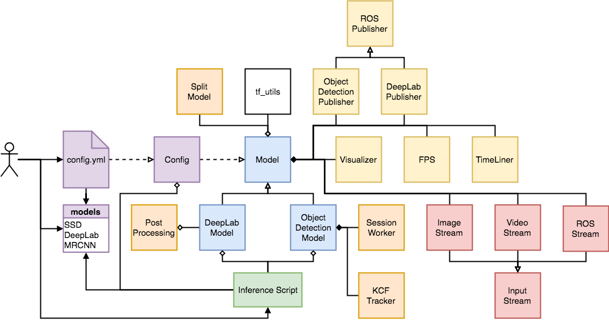

# realtime_object_detection
Realtime Object Detection based on Tensorflow's [Object Detection API](https://github.com/tensorflow/models/tree/master/research/object_detection) and [DeepLab Project](https://github.com/tensorflow/models/tree/master/research/deeplab)

> Version 1: use branch [r1.0](https://github.com/GustavZ/realtime_object_detection/tree/r1.0) for the original repo that was focused on high performance inference of `ssd_mobilenet` <br />
(*x10 Performance Increase on Nvidia Jetson TX2*)

> Version 2: use branch [Master](https://github.com/GustavZ/realtime_object_detection/tree/master) or to be additionally able to run and test Mask-Detection Models, KCF-Tracking and DeepLab Models (*merge of the repo [realtime_segmenation](https://github.com/GustavZ/realtime_segmenation)*)

> ROS Support: To use this Repo as ROS-Package including detection and segmentation ROS-Nodes use branch [ros](https://github.com/GustavZ/realtime_object_detection/tree/ros).
Alternativley use the repo [objectdetection_ros](https://github.com/GustavZ/objectdetection_ros)

## About the Project
The Idea was to create a scaleable realtime-capable object detection pipeline that runs on various systems. <br />
Plug and play, ready to use without deep previous knowledge.<br /> <br />
The project includes following work:
- optional download of tensorflow pretrained models
- do Inference with OpenCV, either through video input or on selected test_images. <br />
supported Models are all `research/object_detection` as well as `research/deeplab` models
- enjoy this project's own `ssd_mobilenet` speed hack, which splits the model in a mutlithreaded cpu and gpu session. <br />
Results in up to x10 performance increase depending on the running system <br />
⇒ which makes it (one of) the fastest inference piplines out there
- run statistic tests on sets of images and get statistical information like mean and median fps, std dev and much more
- create `timeline` files measuring the exact time consumption of each operation in your model
- inspect, summarize, quantize, transform and benchmark models with the provided `scripts/`
- Use this Repo as ROS Package. the detection subscirbes a ROS Image topic and publishes the detection as ROS Node.


## Inference:  
- create a copy of `config.sample.yml` named `config.yml` and only change configurations inside this file <br />
For example: If you are not interested in visualization: set `VISUALIZE` to `False`, <br />
or if you want to switch off the speed hack set `SPLIT_MODEL` to `False`, <br />
- to be able to use KCF_Tracking inside `scripts/` run `bash build_kcf.sh` to build it and set `USE_TRACKER` to `True` to use it <br />
(currently only works for pure object detection models without `SPLIT_MODEL`)
- new class (Model,Config,Visualizer) structure. Simply create your own test file with:
    ```
    from rod.model import ObjectDetectionModel, DeepLabModel
    from rod.config import Config

    model_type = 'od'                                              #or 'dl'
    input_type = 'video'                                           #or 'image'
    config = Config(model_type)
    model = ObjectDetectionModel(config).prepare_model(input_type) #or DeepLabModel
    model.run()
    ```
- Alternativley run `python` + `objectdetection_video.py` or `objectdetection_image.py` or `deeplab_video.py` or `deeplab_image.py` or `allmodels_image.py`


## Scripts:
To make use of the tools provided inside `scripts/` follow this guide: <br />
- first change all paths and variables inside `config_tools.sh` to your needs / according to your system
- When using **the first time** run: `source config_tools.sh` and in the same terminal **run only once** `source build_tools.sh` to build the tools. this will take a while. <br />
- For all following uses first run: `source config_tools.sh`(due to the exported variables) and after that you are able to run the wanted scripts **always from the same terminal** with `source script.sh`.
- All scripts log the terminal output to `test_results/`


## Setup:
Use the following setup for best and verified performance
- Ubuntu 16.04
- Python 2.7
- Tensorflow 1.4
([this repo](https://github.com/peterlee0127/tensorflow-nvJetson) provides pre-build tf wheel files for jetson tx2)
- OpenCV 3.3.1
> Note: tensorflow v1.7.0 seems to have massive performance issues (try to use other versions)

## Current max Performance on `ssd_mobilenet`:
- Dell XPS 15 with i7 @ 2.80GHZ x8 and GeForce GTX 1050 4GB:  **100 FPS**
- Nvidia Jetson Tx2 with Tegra 8GB:                           **30 FPS**


## Related Work:
- [objectdetection_ros](https://github.com/GustavZ/objectdetection_ros): This Repository as ROS Package ready to use
- [test_models](https://github.com/GustavZ/test_models): A repo for models i am currently working on for benchmark tests
- [deeptraining_hands](https://github.com/GustavZ/deeptraining_hands): A repo for setting up the [ego](http://vision.soic.indiana.edu/projects/egohands/)- and [oxford](http://www.robots.ox.ac.uk/~vgg/data/hands/) hands-datasets.<br />
It also contains several scripts to convert various annotation formats to be able to train Networks on different deep learning frameworks <br />
currently supports `.xml`, `.mat`, `.csv`, `.record`, `.txt` annotations
- [yolo_for_tf_od_api](https://github.com/GustavZ/yolo_for_tf_od_api): A repo to be able to include Yolo V2 in tf's object detection api
- [realtime_segmenation](https://github.com/GustavZ/realtime_segmenation): This repo was merged into v2.0
- [Mobile_Mask_RCNN](https://github.com/GustavZ/Mobile_Mask_RCNN): a Keras Model for training Mask R-CNN for mobile deployment
- [tf_training](https://github.com/GustavZ/tf_training): Train Mobile Mask R-CNN Models on AWS Cloud
- [tf_models](https://github.com/GustavZ/tf_models): My `tensorflow/models` fork which includes `yolov2` and `mask_rcnn_mobilenet_v1_coco`
- [eetfm_automation](https://github.com/GustavZ/eetfm_automation): Export and Evaluation of TensorFlow Models Automation based on the Object Detection API
